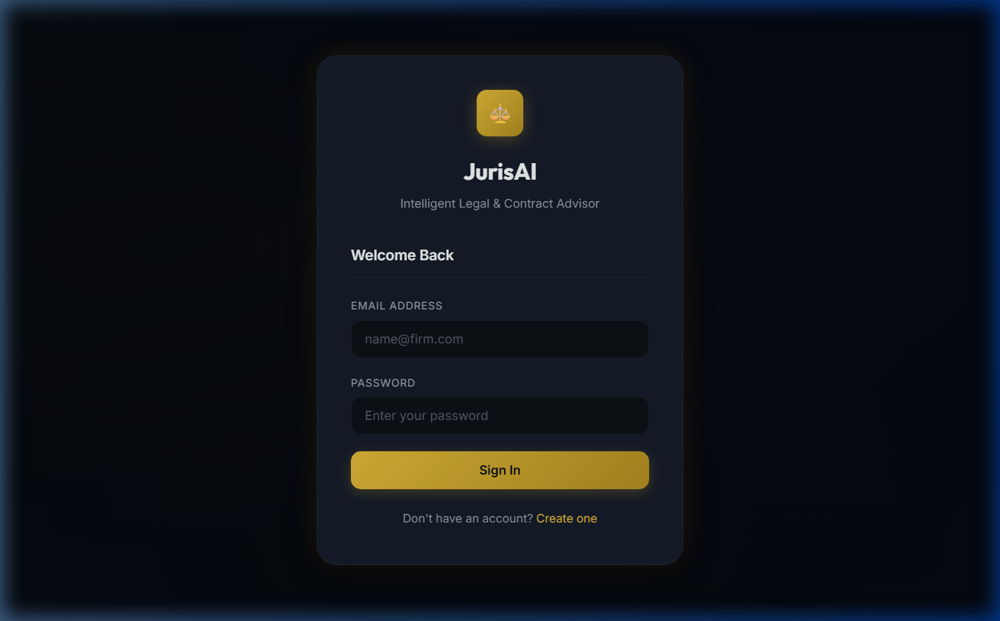
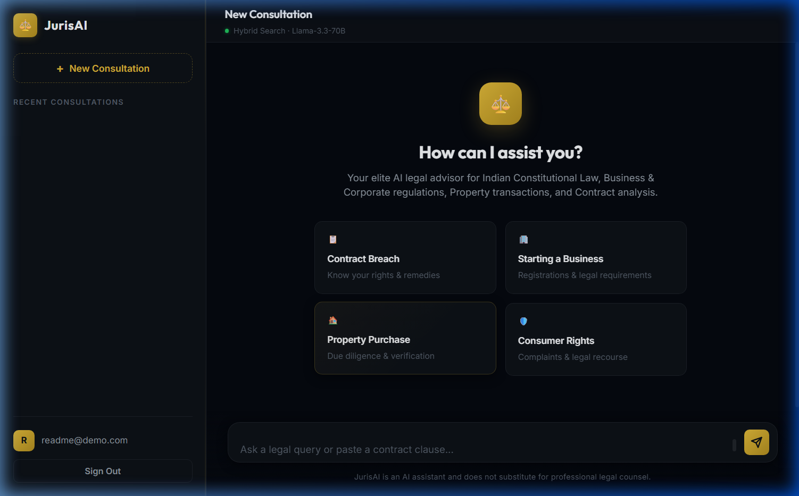
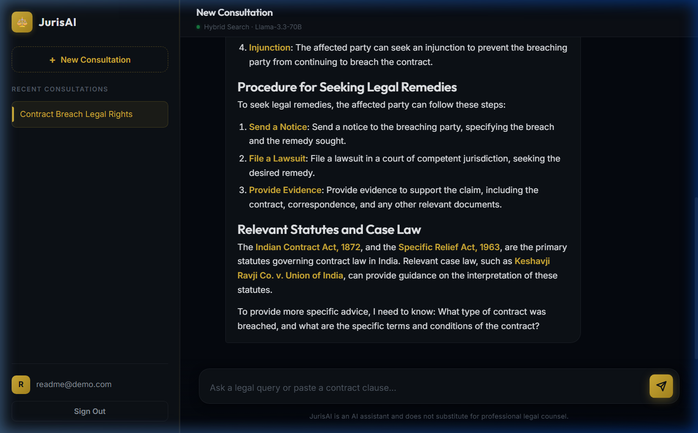

<p align="center">
  
</p>

<h1 align="center">JurisAI — Intelligent Legal Advisor</h1>

<p align="center">
  <strong>An AI-powered legal consultation platform specializing in Indian Law</strong><br/>
  <em>Constitutional · Contract · Corporate · Civil · Criminal</em>
</p>

<p align="center">
  
  
  
  
  
  
</p>

<p align="center">
  <a href="#-screenshots">Screenshots</a> •
  <a href="#-features">Features</a> •
  <a href="#-architecture">Architecture</a> •
  <a href="#-tech-stack">Tech Stack</a> •
  <a href="#-quick-start">Quick Start</a> •
  <a href="#-api-reference">API Reference</a> •
  <a href="#-project-structure">Project Structure</a>
</p>

---

## 📸 Screenshots

<p align="center">
  
  <br/><em>Secure authentication with dark-mode glassmorphism UI</em>
</p>

<p align="center">
  
  <br/><em>Welcome dashboard with quick-start legal query cards</em>
</p>

<p align="center">
  
  <br/><em>AI-powered legal consultation with statute citations and case law references</em>
</p>

---

## ✨ Features

### 🤖 Multi-Agent AI Pipeline
JurisAI uses a **LangGraph-powered multi-agent workflow** where specialized agents handle different stages of legal query processing:

| Agent | Role |
|---|---|
| **Intake Agent** | Classifies queries into legal categories (Constitutional, Contract, Criminal, etc.) |
| **Researcher Agent** | Retrieves relevant legal context using hybrid search (BM25 + Vector) |
| **Synthesizer Agent** | Generates precise legal responses with statute citations |
| **Reviewer Agent** | Reviews and finalizes the response for accuracy |

### 📚 Hybrid Legal Search (RAG)
- **Vector Search** — Semantic similarity via ChromaDB + Sentence Transformers (`all-MiniLM-L6-v2`)
- **BM25 Keyword Search** — Traditional legal keyword matching for precision
- **Ensemble Retriever** — Combines both with weighted fusion for optimal retrieval

### 🔒 Secure Authentication
- JWT-based auth with 7-day token expiration
- Password hashing with bcrypt
- Protected API endpoints with per-user data isolation

### 💬 Persistent Chat History
- SQLite-backed conversation storage
- Multiple chat sessions per user
- AI-generated session titles
- Chat deletion support

### 🎨 Premium Dark-Mode UI
- Glassmorphism design with gold accent palette
- Responsive layout (desktop + mobile sidebar)
- Auto-resizing message input
- Markdown rendering in AI responses
- Typing indicator during processing

---

## 🏗️ Architecture

```
┌──────────────────────────────────────────────────────────────┐
│                        CLIENT (Browser)                       │
│  ┌─────────────┐  ┌──────────────┐  ┌──────────────────────┐ │
│  │  index.html  │  │  style.css   │  │      app.js          │ │
│  │  (Structure) │  │  (Dark UI)   │  │  (SPA Logic + API)   │ │
│  └─────────────┘  └──────────────┘  └──────────────────────┘ │
└──────────────────────────┬───────────────────────────────────┘
                           │ REST API
┌──────────────────────────▼───────────────────────────────────┐
│                    FastAPI Server (main.py)                    │
│  ┌──────────────┐  ┌──────────────┐  ┌──────────────────────┐ │
│  │  Auth Routes  │  │  Chat Routes │  │  Static File Server  │ │
│  │  /api/auth/*  │  │  /api/chat   │  │  /static/*           │ │
│  └──────┬───────┘  └──────┬───────┘  └──────────────────────┘ │
│         │                 │                                    │
│  ┌──────▼───────┐  ┌──────▼──────────────────────────────────┐│
│  │   JWT Auth   │  │        LangGraph Workflow                ││
│  │   + bcrypt   │  │  ┌─────────┐  ┌────────────┐           ││
│  └──────────────┘  │  │ Intake  │→ │ Researcher │           ││
│                    │  │ Agent   │  │   Agent    │           ││
│                    │  └─────────┘  └─────┬──────┘           ││
│                    │                     │                    ││
│                    │  ┌──────────────┐  ┌▼───────────┐       ││
│                    │  │   Reviewer   │← │ Synthesizer│       ││
│                    │  │    Agent     │  │   Agent    │       ││
│                    │  └──────┬───────┘  └────────────┘       ││
│                    └─────────┼────────────────────────────────┘│
│                              │                                 │
│  ┌───────────────────────────▼────────────────────────────────┐│
│  │                    Data Layer                               ││
│  │  ┌──────────┐  ┌──────────────┐  ┌───────────────────────┐ ││
│  │  │ SQLite   │  │  ChromaDB    │  │  BM25 Index           │ ││
│  │  │ Users +  │  │  Vector      │  │  Keyword              │ ││
│  │  │ Chats    │  │  Embeddings  │  │  Retrieval            │ ││
│  │  └──────────┘  └──────────────┘  └───────────────────────┘ ││
│  └────────────────────────────────────────────────────────────┘│
└───────────────────────────────────────────────────────────────┘
                           │
              ┌────────────▼────────────┐
              │    Groq Cloud API       │
              │  Llama 3.3 - 70B        │
              │  (LLM Inference)        │
              └─────────────────────────┘
```

---

## 🛠️ Tech Stack

| Layer | Technology |
|---|---|
| **Frontend** | Vanilla HTML/CSS/JS · Dark Mode Glassmorphism · Google Fonts (Inter, Outfit) |
| **Backend** | FastAPI · Uvicorn · Python 3.10+ |
| **AI/LLM** | LangGraph (Multi-Agent Orchestration) · LangChain · Groq API (Llama 3.3 70B) |
| **Search** | ChromaDB (Vector DB) · Sentence Transformers (all-MiniLM-L6-v2) · BM25 (rank-bm25) |
| **Database** | SQLite (Users, Chats, Messages, Checkpoints) |
| **Auth** | JWT (PyJWT) · bcrypt |
| **Deployment** | Vercel (Serverless) |

---

## 🚀 Quick Start

### Prerequisites
- Python 3.10 or higher
- [Groq API Key](https://console.groq.com/) (free tier available)

### 1. Clone the repository
```bash
git clone https://github.com/harshit-singh-hs/JurisAI.git
cd JurisAI
```

### 2. Create a virtual environment
```bash
python -m venv venv

# Windows
venv\Scripts\activate

# macOS/Linux
source venv/bin/activate
```

### 3. Install dependencies
```bash
pip install -r requirements.txt
pip install sentence-transformers
```

### 4. Set up environment variables
Create a `.env` file in the root directory:
```env
GROQ_API_KEY=your_groq_api_key_here
JWT_SECRET=your_secret_key_here
```

### 5. Ingest legal data (first time only)
```bash
python ingestion/document_loader.py
```

### 6. Run the server
```bash
python main.py
```

Open **http://localhost:8000** in your browser and create an account to start consulting!

---

## 📡 API Reference

### Authentication

| Method | Endpoint | Description |
|---|---|---|
| `POST` | `/api/auth/register` | Create a new account |
| `POST` | `/api/auth/login` | Sign in and get JWT token |
| `GET` | `/api/auth/me` | Get current user info |

### Chat

| Method | Endpoint | Description |
|---|---|---|
| `POST` | `/api/chat` | Send a legal query and get AI response |
| `GET` | `/api/chats` | List all chat sessions |
| `GET` | `/api/chats/{id}/messages` | Get messages for a chat session |
| `PATCH` | `/api/chats/{id}/title` | Update chat session title |
| `DELETE` | `/api/chats/{id}` | Delete a chat session |

### Example Request
```bash
curl -X POST http://localhost:8000/api/chat \
  -H "Authorization: Bearer YOUR_JWT_TOKEN" \
  -H "Content-Type: application/json" \
  -d '{
    "message": "What are my legal rights if someone breaches a contract?",
    "session_id": "unique-session-id"
  }'
```

---

## 📁 Project Structure

```
JurisAI/
├── agents/                    # Multi-agent AI pipeline
│   ├── graph.py               # LangGraph workflow definition
│   ├── intake_agent.py        # Query classification agent
│   ├── researcher_agent.py    # Legal context retrieval agent
│   ├── synthesizer_agent.py   # Response generation agent
│   ├── reviewer_agent.py      # Response review agent
│   ├── prompts.py             # System prompts & templates
│   ├── llm_setup.py           # Groq LLM configuration
│   ├── auth.py                # JWT authentication logic
│   └── state.py               # Agent state schema
│
├── database/                  # Data access layer
│   ├── chroma_setup.py        # ChromaDB vector store config
│   ├── hybrid_search.py       # BM25 + Vector ensemble retriever
│   └── user_db.py             # SQLite user/chat database
│
├── ingestion/                 # Data ingestion pipeline
│   ├── document_loader.py     # Legal document chunking & embedding
│   ├── generate_legal_corpus.py
│   ├── generate_legal_procedures.py
│   └── generate_sample_data.py
│
├── static/                    # Frontend (SPA)
│   ├── index.html             # Main HTML structure
│   ├── style.css              # Dark-mode glassmorphism styles
│   └── app.js                 # Client-side application logic
│
├── models/                    # Pydantic data models
│   └── api_models.py          # Request/response schemas
│
├── evaluation/                # Evaluation scripts
│   ├── generate_dataset.py    # Test dataset generation
│   └── run_eval.py            # Response quality evaluation
│
├── main.py                    # FastAPI application entry point
├── requirements.txt           # Python dependencies
├── vercel.json                # Vercel deployment config
└── .env                       # Environment variables (not tracked)
```

---

## 🔧 Configuration

| Variable | Description | Required |
|---|---|---|
| `GROQ_API_KEY` | API key from [Groq Console](https://console.groq.com/) | ✅ |
| `JWT_SECRET` | Secret key for JWT token signing | Optional (has default) |

---

## 📋 Legal Domains Covered

- **Constitutional Law** — Fundamental Rights, Directive Principles, landmark Supreme Court judgments
- **Contract Law** — Indian Contract Act 1872, NDA/Agreement drafting & review, breach remedies
- **Corporate Law** — Companies Act 2013, incorporation, ROC filings, compliance
- **Property Law** — Transfer of Property Act 1882, Registration Act 1908, RERA 2016
- **Criminal Law** — IPC/BNS provisions, CrPC procedures, FIR, bail, complaints
- **Consumer Law** — Consumer Protection Act 2019, complaint filing, dispute resolution
- **Business Compliance** — GST, FEMA, startup registrations, regulatory requirements

---

## ⚠️ Disclaimer

> **JurisAI is an AI assistant and does not substitute for professional legal counsel.** The information provided is for educational and informational purposes only. Always consult a qualified lawyer for specific legal matters.

---

## 🤝 Contributing

Contributions are welcome! Please feel free to submit a Pull Request.

1. Fork the repository
2. Create your feature branch (`git checkout -b feature/AmazingFeature`)
3. Commit your changes (`git commit -m 'Add AmazingFeature'`)
4. Push to the branch (`git push origin feature/AmazingFeature`)
5. Open a Pull Request

---

## 📄 License

This project is licensed under the MIT License — see the [LICENSE](LICENSE) file for details.

---

<p align="center">
  <strong>Built with ❤️ by <a href="https://github.com/harshit-singh-hs">Harshit Singh</a></strong><br/>
  <sub>If you found this useful, consider giving it a ⭐</sub>
</p>
